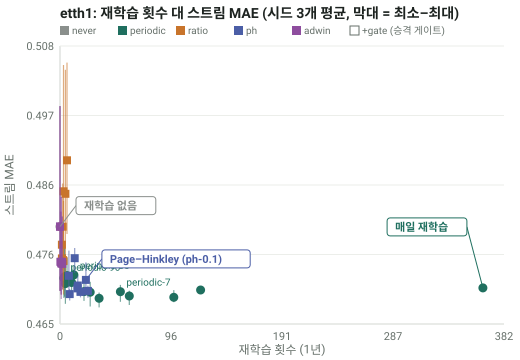
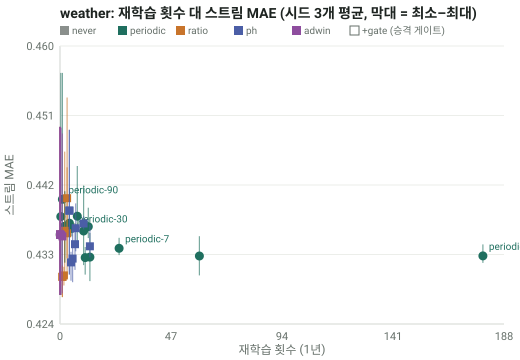
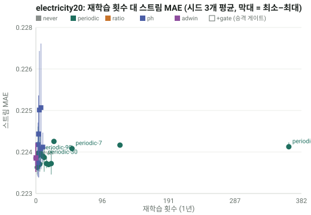
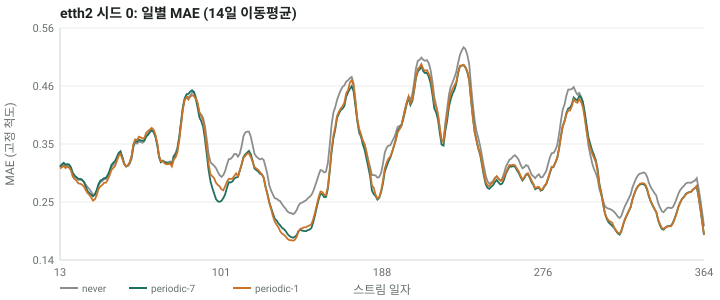

# 결과: 재학습 정책 비교

사전 등록 프로토콜 [protocol.md](protocol.md) 의 결과입니다. 모든 수치는 `artifacts/cadence_summary.json` 에서 마커로 읽어 오며
`scripts/check_numbers.py` 가 CI 에서 대조합니다. 값은 시드 평균(시드 수는 요약표와 H3·H4 표에 표시), 척도는 초기 학습 구간 표준편차 단위의 MAE (낮을수록 좋음),
"재학습"은 실제로 교체된 횟수입니다.

## 요약표 (확장 창, DLinear)

| 데이터셋 | 시드 | never | periodic-30 | periodic-7 | periodic-1 | periodic-1 개선율 | 95% 구간 (periodic-1 − never) |
|---|---:|---:|---:|---:|---:|---:|---|
| etth1 | <!-- num:artifacts/cadence_summary.json#datasets/etth1/expanding/policies/never/n_seeds:d -->3<!-- /num --> | <!-- num:artifacts/cadence_summary.json#datasets/etth1/expanding/policies/never/mae_mean:.4f -->0.4799<!-- /num --> | <!-- num:artifacts/cadence_summary.json#datasets/etth1/expanding/policies/periodic-30/mae_mean:.4f -->0.4726<!-- /num --> | <!-- num:artifacts/cadence_summary.json#datasets/etth1/expanding/policies/periodic-7/mae_mean:.4f -->0.4700<!-- /num --> | <!-- num:artifacts/cadence_summary.json#datasets/etth1/expanding/policies/periodic-1/mae_mean:.4f -->0.4706<!-- /num --> | <!-- num:artifacts/cadence_summary.json#datasets/etth1/expanding/policies/periodic-1/improvement_vs_never_pct:+.2f -->+1.88<!-- /num -->% | [<!-- num:artifacts/cadence_summary.json#datasets/etth1/expanding/policies/periodic-1/ci_vs_never/lo_mean:+.4f -->-0.0131<!-- /num -->, <!-- num:artifacts/cadence_summary.json#datasets/etth1/expanding/policies/periodic-1/ci_vs_never/hi_mean:+.4f -->-0.0056<!-- /num -->] |
| etth2 | <!-- num:artifacts/cadence_summary.json#datasets/etth2/expanding/policies/never/n_seeds:d -->3<!-- /num --> | <!-- num:artifacts/cadence_summary.json#datasets/etth2/expanding/policies/never/mae_mean:.4f -->0.3401<!-- /num --> | <!-- num:artifacts/cadence_summary.json#datasets/etth2/expanding/policies/periodic-30/mae_mean:.4f -->0.3200<!-- /num --> | <!-- num:artifacts/cadence_summary.json#datasets/etth2/expanding/policies/periodic-7/mae_mean:.4f -->0.3163<!-- /num --> | <!-- num:artifacts/cadence_summary.json#datasets/etth2/expanding/policies/periodic-1/mae_mean:.4f -->0.3169<!-- /num --> | <!-- num:artifacts/cadence_summary.json#datasets/etth2/expanding/policies/periodic-1/improvement_vs_never_pct:+.2f -->+6.79<!-- /num -->% | [<!-- num:artifacts/cadence_summary.json#datasets/etth2/expanding/policies/periodic-1/ci_vs_never/lo_mean:+.4f -->-0.0297<!-- /num -->, <!-- num:artifacts/cadence_summary.json#datasets/etth2/expanding/policies/periodic-1/ci_vs_never/hi_mean:+.4f -->-0.0168<!-- /num -->] |
| weather | <!-- num:artifacts/cadence_summary.json#datasets/weather/expanding/policies/never/n_seeds:d -->3<!-- /num --> | <!-- num:artifacts/cadence_summary.json#datasets/weather/expanding/policies/never/mae_mean:.4f -->0.4359<!-- /num --> | <!-- num:artifacts/cadence_summary.json#datasets/weather/expanding/policies/periodic-30/mae_mean:.4f -->0.4367<!-- /num --> | <!-- num:artifacts/cadence_summary.json#datasets/weather/expanding/policies/periodic-7/mae_mean:.4f -->0.4341<!-- /num --> | <!-- num:artifacts/cadence_summary.json#datasets/weather/expanding/policies/periodic-1/mae_mean:.4f -->0.4332<!-- /num --> | <!-- num:artifacts/cadence_summary.json#datasets/weather/expanding/policies/periodic-1/improvement_vs_never_pct:+.2f -->+0.58<!-- /num -->% | [<!-- num:artifacts/cadence_summary.json#datasets/weather/expanding/policies/periodic-1/ci_vs_never/lo_mean:+.4f -->-0.0096<!-- /num -->, <!-- num:artifacts/cadence_summary.json#datasets/weather/expanding/policies/periodic-1/ci_vs_never/hi_mean:+.4f -->+0.0043<!-- /num -->] |
| electricity20 | <!-- num:artifacts/cadence_summary.json#datasets/electricity20/expanding/policies/never/n_seeds:d -->3<!-- /num --> | <!-- num:artifacts/cadence_summary.json#datasets/electricity20/expanding/policies/never/mae_mean:.4f -->0.2237<!-- /num --> | <!-- num:artifacts/cadence_summary.json#datasets/electricity20/expanding/policies/periodic-30/mae_mean:.4f -->0.2237<!-- /num --> | <!-- num:artifacts/cadence_summary.json#datasets/electricity20/expanding/policies/periodic-7/mae_mean:.4f -->0.2240<!-- /num --> | <!-- num:artifacts/cadence_summary.json#datasets/electricity20/expanding/policies/periodic-1/mae_mean:.4f -->0.2240<!-- /num --> | <!-- num:artifacts/cadence_summary.json#datasets/electricity20/expanding/policies/periodic-1/improvement_vs_never_pct:+.2f -->-0.15<!-- /num -->% | [<!-- num:artifacts/cadence_summary.json#datasets/electricity20/expanding/policies/periodic-1/ci_vs_never/lo_mean:+.4f -->-0.0001<!-- /num -->, <!-- num:artifacts/cadence_summary.json#datasets/electricity20/expanding/policies/periodic-1/ci_vs_never/hi_mean:+.4f -->+0.0008<!-- /num -->] |

구간은 7일 블록 페어드 부트스트랩(1,000회)을 시드별로 구한 뒤 평균한 것입니다. 음수 = periodic-1 이 더 낫다.

## 감시 기반 정책 (격자 대표점)

| 데이터셋 | ratio-0.2 MAE / 재학습 | ph-0.1 MAE / 재학습 | adwin-0.01 MAE / 재학습 | periodic-1 대비 이득 비율 (H2 최선) |
|---|---|---|---|---|
| etth1 | <!-- num:artifacts/cadence_summary.json#datasets/etth1/expanding/policies/ratio-0.2/mae_mean:.4f -->0.4914<!-- /num --> / <!-- num:artifacts/cadence_summary.json#datasets/etth1/expanding/policies/ratio-0.2/n_refits_mean:.1f -->4.3<!-- /num --> | <!-- num:artifacts/cadence_summary.json#datasets/etth1/expanding/policies/ph-0.1/mae_mean:.4f -->0.4702<!-- /num --> / <!-- num:artifacts/cadence_summary.json#datasets/etth1/expanding/policies/ph-0.1/n_refits_mean:.1f -->21.7<!-- /num --> | <!-- num:artifacts/cadence_summary.json#datasets/etth1/expanding/policies/adwin-0.01/mae_mean:.4f -->0.4747<!-- /num --> / <!-- num:artifacts/cadence_summary.json#datasets/etth1/expanding/policies/adwin-0.01/n_refits_mean:.1f -->1.0<!-- /num --> | <!-- num:artifacts/cadence_summary.json#hypotheses/H2/rows/etth1/policy -->ph-0.1<!-- /num -->: <!-- num:artifacts/cadence_summary.json#hypotheses/H2/rows/etth1/gain_fraction:.2f -->1.04<!-- /num --> |
| etth2 | <!-- num:artifacts/cadence_summary.json#datasets/etth2/expanding/policies/ratio-0.2/mae_mean:.4f -->0.3242<!-- /num --> / <!-- num:artifacts/cadence_summary.json#datasets/etth2/expanding/policies/ratio-0.2/n_refits_mean:.1f -->3.7<!-- /num --> | <!-- num:artifacts/cadence_summary.json#datasets/etth2/expanding/policies/ph-0.1/mae_mean:.4f -->0.3173<!-- /num --> / <!-- num:artifacts/cadence_summary.json#datasets/etth2/expanding/policies/ph-0.1/n_refits_mean:.1f -->19.0<!-- /num --> | <!-- num:artifacts/cadence_summary.json#datasets/etth2/expanding/policies/adwin-0.01/mae_mean:.4f -->0.3401<!-- /num --> / <!-- num:artifacts/cadence_summary.json#datasets/etth2/expanding/policies/adwin-0.01/n_refits_mean:.1f -->0.0<!-- /num --> | <!-- num:artifacts/cadence_summary.json#hypotheses/H2/rows/etth2/policy -->ph-0.1<!-- /num -->: <!-- num:artifacts/cadence_summary.json#hypotheses/H2/rows/etth2/gain_fraction:.2f -->0.98<!-- /num --> |
| weather | <!-- num:artifacts/cadence_summary.json#datasets/weather/expanding/policies/ratio-0.2/mae_mean:.4f -->0.4364<!-- /num --> / <!-- num:artifacts/cadence_summary.json#datasets/weather/expanding/policies/ratio-0.2/n_refits_mean:.1f -->2.0<!-- /num --> | <!-- num:artifacts/cadence_summary.json#datasets/weather/expanding/policies/ph-0.1/mae_mean:.4f -->0.4373<!-- /num --> / <!-- num:artifacts/cadence_summary.json#datasets/weather/expanding/policies/ph-0.1/n_refits_mean:.1f -->10.0<!-- /num --> | <!-- num:artifacts/cadence_summary.json#datasets/weather/expanding/policies/adwin-0.01/mae_mean:.4f -->0.4359<!-- /num --> / <!-- num:artifacts/cadence_summary.json#datasets/weather/expanding/policies/adwin-0.01/n_refits_mean:.1f -->0.0<!-- /num --> | <!-- num:artifacts/cadence_summary.json#hypotheses/H2/rows/weather/policy -->—<!-- /num --> (정의 안 됨) |
| electricity20 | <!-- num:artifacts/cadence_summary.json#datasets/electricity20/expanding/policies/ratio-0.2/mae_mean:.4f -->0.2237<!-- /num --> / <!-- num:artifacts/cadence_summary.json#datasets/electricity20/expanding/policies/ratio-0.2/n_refits_mean:.1f -->0.0<!-- /num --> | <!-- num:artifacts/cadence_summary.json#datasets/electricity20/expanding/policies/ph-0.1/mae_mean:.4f -->0.2252<!-- /num --> / <!-- num:artifacts/cadence_summary.json#datasets/electricity20/expanding/policies/ph-0.1/n_refits_mean:.1f -->7.3<!-- /num --> | <!-- num:artifacts/cadence_summary.json#datasets/electricity20/expanding/policies/adwin-0.01/mae_mean:.4f -->0.2237<!-- /num --> / <!-- num:artifacts/cadence_summary.json#datasets/electricity20/expanding/policies/adwin-0.01/n_refits_mean:.1f -->0.0<!-- /num --> | <!-- num:artifacts/cadence_summary.json#hypotheses/H2/rows/electricity20/policy -->—<!-- /num --> (정의 안 됨) |

이득 비율 = (never − 정책) / (never − periodic-1), 시드 평균 MAE 로 계산. 1.0 이면 매일 재학습과 같은 이득, 음수면 never 보다 나쁨.
매일 재학습이 never 를 이기고 그 구간 상한이 0 아래로 확인된 데이터셋(etth1, etth2)에서만 정의합니다. 이득이 없는 데이터셋의 "이득의 몇 %"는 의미가 없습니다([protocol.md](protocol.md) 변경 이력의 사후 정정).

## 사전 가설 판정

| 가설 | 기준 (protocol P9) | 판정 |
|---|---|---|
| H1 재학습은 도움이 된다 | 4개 데이터셋 모두 periodic-1 < never 이고 95% 구간 상한 < 0 | <!-- num:artifacts/cadence_summary.json#hypotheses/H1/pass -->False<!-- /num --> |
| H2 감시 정책이 적은 재학습으로 이득의 80% 이상 | 대표점 중 하나가 ≥ 0.8 이득을 ≤ 91회로 (어느 데이터셋이든) | <!-- num:artifacts/cadence_summary.json#hypotheses/H2/pass -->True<!-- /num --> |
| H3 웜 스타트는 콜드와 같은 정확도를 1/3 비용으로 | etth1·etth2 에서 MAE +1% 이내, 학습 시간 ≤ 1/3 | <!-- num:artifacts/cadence_summary.json#hypotheses/H3/pass -->False<!-- /num --> |
| H4 확장 창 ≤ 슬라이딩 창 | etth1·etth2 periodic-7 | <!-- num:artifacts/cadence_summary.json#hypotheses/H4/pass -->True<!-- /num --> |

## 읽는 법

**재학습의 가치는 데이터셋이 정한다.** ETTh2 에서는 매일 재학습이 never 보다
<!-- num:artifacts/cadence_summary.json#datasets/etth2/expanding/policies/periodic-1/improvement_vs_never_pct:.1f -->6.8<!-- /num -->% 낮은 MAE 를 내고
(구간 전체가 0 아래), 분기 1회(periodic-90)만 해도
<!-- num:artifacts/cadence_summary.json#datasets/etth2/expanding/policies/periodic-90/improvement_vs_never_pct:.1f -->2.4<!-- /num -->% 를 얻습니다.
ETTh1 은 <!-- num:artifacts/cadence_summary.json#datasets/etth1/expanding/policies/periodic-1/improvement_vs_never_pct:.1f -->1.9<!-- /num -->% 로 작고,
그 대부분은 초기 모델이 운 나쁘게 학습된 시드 하나(never 최대 <!-- num:artifacts/cadence_summary.json#datasets/etth1/expanding/policies/never/mae_max:.4f -->0.4983<!-- /num -->,
최소 <!-- num:artifacts/cadence_summary.json#datasets/etth1/expanding/policies/never/mae_min:.4f -->0.4702<!-- /num -->)를 재학습이 구제한 몫입니다.
weather 와 electricity20 에서는 매일 재학습이 never 보다 **낫지 않습니다**
(각 <!-- num:artifacts/cadence_summary.json#datasets/weather/expanding/policies/periodic-1/improvement_vs_never_pct:+.1f -->+0.6<!-- /num -->%,
<!-- num:artifacts/cadence_summary.json#datasets/electricity20/expanding/policies/periodic-1/improvement_vs_never_pct:+.1f -->-0.1<!-- /num -->%; 구간이 0 을 포함).
그래서 **H1 은 기각**입니다 — "재학습은 늘 도움이 된다"는 이 네 데이터셋에서 참이 아닙니다.

**감시 기반 재학습은 되는 곳에서는 싸게 됩니다.** ETTh2 에서 Page–Hinkley(ph-0.1)는 매일 재학습 이득의
<!-- num:artifacts/cadence_summary.json#hypotheses/H2/rows/etth2/gain_fraction:.2f -->0.98<!-- /num -->배를
재학습 <!-- num:artifacts/cadence_summary.json#hypotheses/H2/rows/etth2/n_refits:.0f -->19<!-- /num -->회(매일의 약 5%)로 얻고,
ETTh1 에서도 <!-- num:artifacts/cadence_summary.json#hypotheses/H2/rows/etth1/n_refits:.0f -->22<!-- /num -->회로 매일 재학습과 같거나 더 낮은 MAE 를 냅니다(**H2 통과**).
반면 비율 규칙(ratio-0.2)은 ETTh1 에서 never 보다
<!-- num:artifacts/cadence_summary.json#datasets/etth1/expanding/policies/ratio-0.2/improvement_vs_never_pct:+.1f -->-2.6<!-- /num -->% 로 **해롭습니다**:
2017년 여름의 이상 구간 한가운데서 울려 그 구간에 맞춘 모델을 배포하고, 그 모델의 높은 검증 MAE 가 새 기준선이 되어 다시는 울리지 않습니다.
ADWIN 은 δ=0.01 에서 거의 울리지 않아(일 단위 표본 수십 개로는 Hoeffding 경계가 너무 보수적) 사실상 never 와 같습니다.

**승격 게이트는 해로운 교체를 걸러 내지만 공짜는 아닙니다.** 같은 일정에서 후보가 자기 검증 구간 중 결정 시점에 완결된 날들(직전 14일 중 10일)에서 현역보다 낫지 않으면 교체하지 않는 `+gate` 는
ETTh1 periodic-7 의 교체를 52회에서 <!-- num:artifacts/cadence_summary.json#datasets/etth1/expanding/policies/periodic-7+gate/n_refits_mean:.0f -->16<!-- /num -->회로 줄이면서 MAE 는 <!-- num:artifacts/cadence_summary.json#datasets/etth1/expanding/policies/periodic-7/mae_mean:.4f -->0.4700<!-- /num --> 에서 <!-- num:artifacts/cadence_summary.json#datasets/etth1/expanding/policies/periodic-7+gate/mae_mean:.4f -->0.4690<!-- /num --> 로 오히려 낮아지고,
이상 구간에서 울려 해로웠던 ratio-0.2 의 손해를 크게 덜어 냅니다(ETTh1 <!-- num:artifacts/cadence_summary.json#datasets/etth1/expanding/policies/ratio-0.2/mae_mean:.4f -->0.4914<!-- /num --> → <!-- num:artifacts/cadence_summary.json#datasets/etth1/expanding/policies/ratio-0.2+gate/mae_mean:.4f -->0.4782<!-- /num -->,
weather <!-- num:artifacts/cadence_summary.json#datasets/weather/expanding/policies/ratio-0.2/mae_mean:.4f -->0.4364<!-- /num --> → <!-- num:artifacts/cadence_summary.json#datasets/weather/expanding/policies/ratio-0.2+gate/mae_mean:.4f -->0.4307<!-- /num -->).
반면 재학습이 잘 통하는 ETTh2 에서는 이득이 없고 ph-0.1 은 <!-- num:artifacts/cadence_summary.json#datasets/etth2/expanding/policies/ph-0.1/mae_mean:.4f -->0.3173<!-- /num --> 에서 <!-- num:artifacts/cadence_summary.json#datasets/etth2/expanding/policies/ph-0.1+gate/mae_mean:.4f -->0.3201<!-- /num --> 로 오히려 나빠집니다.
재학습이 돕지 않는 weather 에서 매일 재학습의 개선율은 <!-- num:artifacts/cadence_summary.json#datasets/weather/expanding/policies/periodic-1/improvement_vs_never_pct:+.2f -->+0.58<!-- /num -->% 에서 게이트를 붙여도 <!-- num:artifacts/cadence_summary.json#datasets/weather/expanding/policies/periodic-1+gate/improvement_vs_never_pct:+.2f -->+0.62<!-- /num -->% 로 거의 같습니다.
게이트는 학습 비용을 줄이지는 못합니다(후보는 어차피 학습합니다) — 줄이는 것은 **나쁜 모델이 서비스에 오르는 횟수**입니다.
이 변형은 첫 결과를 본 뒤 추가한 사후 탐색이므로 가설 판정에는 쓰지 않았습니다.

**웜 스타트는 정확도를 잃었고, 비용 이득은 어떻게 재느냐에 달렸습니다(H3 기각).** 전날 가중치에서 2 epoch 만 이어 학습하면
MAE 가 콜드 매일 재학습보다 etth1 에서 <!-- num:artifacts/cadence_summary.json#hypotheses/H3/rows/etth1/mae_warm:.4f -->0.4783<!-- /num --> 대
<!-- num:artifacts/cadence_summary.json#hypotheses/H3/rows/etth1/mae_cold:.4f -->0.4706<!-- /num -->, etth2 에서
<!-- num:artifacts/cadence_summary.json#hypotheses/H3/rows/etth2/mae_warm:.4f -->0.3228<!-- /num --> 대
<!-- num:artifacts/cadence_summary.json#hypotheses/H3/rows/etth2/mae_cold:.4f -->0.3169<!-- /num --> 로 각각 <!-- num:artifacts/cadence_summary.json#hypotheses/H3/rows/etth1/mae_change_pct:+.1f -->+1.6<!-- /num -->%,
<!-- num:artifacts/cadence_summary.json#hypotheses/H3/rows/etth2/mae_change_pct:+.1f -->+1.9<!-- /num -->% 나빠 +1% 기준을 넘었습니다. 시드마다 따로 봐도 가장 작은 변화가 etth1 시드 1 의 <!-- num:artifacts/cadence_summary.json#hypotheses/H3/rows/etth1/mae_change_pct_by_seed/1:+.2f -->+1.40<!-- /num -->%,
가장 큰 변화가 etth2 시드 2 의 <!-- num:artifacts/cadence_summary.json#hypotheses/H3/rows/etth2/mae_change_pct_by_seed/2:+.2f -->+1.95<!-- /num -->% 라 여섯 실행이 모두 기준을 넘고
시드 편차로 설명되지 않습니다. 학습한 epoch 수의 합은 콜드의
<!-- num:artifacts/cadence_summary.json#hypotheses/H3/rows/etth1/epochs_ratio:.2f -->0.23<!-- /num -->배(etth1)·<!-- num:artifacts/cadence_summary.json#hypotheses/H3/rows/etth2/epochs_ratio:.2f -->0.25<!-- /num -->배(etth2)로,
이 척도로는 1/3 기준보다 쌉니다. 초 단위 비용은 믿을 수 없어 판정에 쓰지 않았습니다: 같은 일의 초가 시드 0 에서는 콜드의
<!-- num:artifacts/cadence_summary.json#hypotheses/H3/rows/etth1/seconds_ratio_by_seed/0:.2f -->0.16<!-- /num -->배였고 시드 1·2 에서는
<!-- num:artifacts/cadence_summary.json#hypotheses/H3/rows/etth1/seconds_ratio_by_seed/1:.2f -->0.49<!-- /num -->·<!-- num:artifacts/cadence_summary.json#hypotheses/H3/rows/etth1/seconds_ratio_by_seed/2:.2f -->0.46<!-- /num -->배(etth1)로,
웜 체인을 돌린 프로세스 수(2개 대 4개)와 컨테이너가 달라 부하가 달랐기 때문입니다([protocol.md](protocol.md) 변경 이력).
낮은 학습률로 조금씩 움직이는 모델은 오래된 데이터의 해를 천천히 잊기 때문으로 보이며, 이 설정(2 epoch, lr 1e-3)만 시험했습니다.

**확장 창이 슬라이딩 창보다 낫습니다(H4 통과).** 초기 학습 구간 길이의 최근 창만 쓰면 etth1·etth2 모두에서 periodic-7 MAE 가 높아집니다.
이 데이터에서는 오래된 해의 패턴도 여전히 쓸모가 있고, 재학습의 이득은 "최근 것만 보기"가 아니라 "새 데이터를 더하기"에서 옵니다.

**운영에 옮기면:** (1) 재학습 정책을 고르기 전에 이 캐시 실험을 그 데이터로 한 번 돌려 "재학습이 돕는 데이터인지"부터 확인하고,
(2) 돕는다면 매일 재학습의 이득을 훨씬 적은 교체로 얻을 수 있습니다: 주 1회 + 승격 게이트는 매일 재학습과 비슷한 MAE 를
(ETTh1 <!-- num:artifacts/cadence_summary.json#datasets/etth1/expanding/policies/periodic-7+gate/mae_mean:.4f -->0.4690<!-- /num --> 대 <!-- num:artifacts/cadence_summary.json#datasets/etth1/expanding/policies/periodic-1/mae_mean:.4f -->0.4706<!-- /num -->, ETTh2 <!-- num:artifacts/cadence_summary.json#datasets/etth2/expanding/policies/periodic-7+gate/mae_mean:.4f -->0.3166<!-- /num --> 대 <!-- num:artifacts/cadence_summary.json#datasets/etth2/expanding/policies/periodic-1/mae_mean:.4f -->0.3169<!-- /num -->)
교체 <!-- num:artifacts/cadence_summary.json#datasets/etth1/expanding/policies/periodic-7+gate/n_refits_mean:.0f -->16<!-- /num -->회·<!-- num:artifacts/cadence_summary.json#datasets/etth2/expanding/policies/periodic-7+gate/n_refits_mean:.0f -->19<!-- /num -->회(매일은 364회)로 냅니다. 게이트는 이상 구간 재학습이 위험한 데이터에서 가치가 크고 ETTh2 처럼 잘 통하는 데이터에서는 중립이거나 조금 손해이니, 붙일지는 이 실험으로 정하세요.
(3) 돕지 않는다면 재학습 자동화는 비용이자 위험입니다. 서비스 쪽(`metronome serve` + `worker`)은 이 세 가지를 그대로 설정으로 받습니다.

## 웜 스타트 (H3, etth1·etth2)

| 데이터셋 | 시드 (짝지음) | periodic-1 (콜드) MAE | warm-1 MAE | 학습 epoch 비율 (웜/콜드) | 학습 초 비율 (참고, 부하에 좌우) |
|---|---:|---:|---:|---:|---:|
| etth1 | <!-- num:artifacts/cadence_summary.json#hypotheses/H3/rows/etth1/n_seeds:d -->3<!-- /num --> | <!-- num:artifacts/cadence_summary.json#hypotheses/H3/rows/etth1/mae_cold:.4f -->0.4706<!-- /num --> | <!-- num:artifacts/cadence_summary.json#hypotheses/H3/rows/etth1/mae_warm:.4f -->0.4783<!-- /num --> | <!-- num:artifacts/cadence_summary.json#hypotheses/H3/rows/etth1/epochs_ratio:.2f -->0.23<!-- /num --> | <!-- num:artifacts/cadence_summary.json#hypotheses/H3/rows/etth1/seconds_ratio:.2f -->0.34<!-- /num --> |
| etth2 | <!-- num:artifacts/cadence_summary.json#hypotheses/H3/rows/etth2/n_seeds:d -->3<!-- /num --> | <!-- num:artifacts/cadence_summary.json#hypotheses/H3/rows/etth2/mae_cold:.4f -->0.3169<!-- /num --> | <!-- num:artifacts/cadence_summary.json#hypotheses/H3/rows/etth2/mae_warm:.4f -->0.3228<!-- /num --> | <!-- num:artifacts/cadence_summary.json#hypotheses/H3/rows/etth2/epochs_ratio:.2f -->0.25<!-- /num --> | <!-- num:artifacts/cadence_summary.json#hypotheses/H3/rows/etth2/seconds_ratio:.2f -->0.34<!-- /num --> |

## 확장 창 대 슬라이딩 창 (H4, periodic-7)

| 데이터셋 | 시드 (짝지음) | 확장 창 MAE | 슬라이딩 창 MAE |
|---|---:|---:|---:|
| etth1 | <!-- num:artifacts/cadence_summary.json#hypotheses/H4/rows/etth1/n_seeds:d -->3<!-- /num --> | <!-- num:artifacts/cadence_summary.json#hypotheses/H4/rows/etth1/mae_expanding:.4f -->0.4700<!-- /num --> | <!-- num:artifacts/cadence_summary.json#hypotheses/H4/rows/etth1/mae_sliding:.4f -->0.4745<!-- /num --> |
| etth2 | <!-- num:artifacts/cadence_summary.json#hypotheses/H4/rows/etth2/n_seeds:d -->3<!-- /num --> | <!-- num:artifacts/cadence_summary.json#hypotheses/H4/rows/etth2/mae_expanding:.4f -->0.3163<!-- /num --> | <!-- num:artifacts/cadence_summary.json#hypotheses/H4/rows/etth2/mae_sliding:.4f -->0.3186<!-- /num --> |

## 시드 확장 (사후, 시드 8개)

사전 등록 시드 {0,1,2} 만으로는 분산 추정이 약해 etth1·etth2·weather 에 시드 3~7 을 추가했습니다(electricity20 은 시드당
2시간 이상이라 3개 그대로). 분석 계획은 실행 전에 [protocol.md](protocol.md) 변경 이력에 적었습니다: 헤드라인과 H1~H4 판정은 위의
사전 등록 시드 그대로 두고, 같은 통계를 시드 전체로 다시 계산한 것이 아래 **확장 결과**이며, 어떤 시드도 빼지 않았습니다.

| 데이터셋 | 시드 | never | 매일 재학습 | 개선율 | 95% 구간 (매일 − 안 함) | 매일이 never 보다 나은 시드 | 시드별 개선율 범위 |
|---|---:|---:|---:|---:|---|---:|---|
| etth1 | <!-- num:artifacts/cadence_summary_extended.json#datasets/etth1/expanding/policies/periodic-1/n_seeds:d -->8<!-- /num --> | <!-- num:artifacts/cadence_summary_extended.json#datasets/etth1/expanding/policies/never/mae_mean:.4f -->0.4764<!-- /num --> | <!-- num:artifacts/cadence_summary_extended.json#datasets/etth1/expanding/policies/periodic-1/mae_mean:.4f -->0.4703<!-- /num --> | <!-- num:artifacts/cadence_summary_extended.json#datasets/etth1/expanding/policies/periodic-1/improvement_vs_never_pct:+.2f -->+1.24<!-- /num -->% | [<!-- num:artifacts/cadence_summary_extended.json#datasets/etth1/expanding/policies/periodic-1/ci_vs_never/lo_mean:+.4f -->-0.0099<!-- /num -->, <!-- num:artifacts/cadence_summary_extended.json#datasets/etth1/expanding/policies/periodic-1/ci_vs_never/hi_mean:+.4f -->-0.0022<!-- /num -->] | <!-- num:artifacts/cadence_summary_extended.json#datasets/etth1/expanding/policies/periodic-1/n_seeds_better_than_never:d -->6<!-- /num --> / <!-- num:artifacts/cadence_summary_extended.json#datasets/etth1/expanding/policies/periodic-1/n_seeds:d -->8<!-- /num --> | <!-- num:artifacts/cadence_summary_extended.json#datasets/etth1/expanding/policies/periodic-1/improvement_vs_never_pct_min:+.2f -->-0.17<!-- /num --> ~ <!-- num:artifacts/cadence_summary_extended.json#datasets/etth1/expanding/policies/periodic-1/improvement_vs_never_pct_max:+.2f -->+5.52<!-- /num -->% (중앙값 <!-- num:artifacts/cadence_summary_extended.json#datasets/etth1/expanding/policies/periodic-1/improvement_vs_never_pct_median:+.2f -->+0.22<!-- /num -->%) |
| etth2 | <!-- num:artifacts/cadence_summary_extended.json#datasets/etth2/expanding/policies/periodic-1/n_seeds:d -->8<!-- /num --> | <!-- num:artifacts/cadence_summary_extended.json#datasets/etth2/expanding/policies/never/mae_mean:.4f -->0.3411<!-- /num --> | <!-- num:artifacts/cadence_summary_extended.json#datasets/etth2/expanding/policies/periodic-1/mae_mean:.4f -->0.3169<!-- /num --> | <!-- num:artifacts/cadence_summary_extended.json#datasets/etth2/expanding/policies/periodic-1/improvement_vs_never_pct:+.2f -->+7.07<!-- /num -->% | [<!-- num:artifacts/cadence_summary_extended.json#datasets/etth2/expanding/policies/periodic-1/ci_vs_never/lo_mean:+.4f -->-0.0310<!-- /num -->, <!-- num:artifacts/cadence_summary_extended.json#datasets/etth2/expanding/policies/periodic-1/ci_vs_never/hi_mean:+.4f -->-0.0179<!-- /num -->] | <!-- num:artifacts/cadence_summary_extended.json#datasets/etth2/expanding/policies/periodic-1/n_seeds_better_than_never:d -->8<!-- /num --> / <!-- num:artifacts/cadence_summary_extended.json#datasets/etth2/expanding/policies/periodic-1/n_seeds:d -->8<!-- /num --> | <!-- num:artifacts/cadence_summary_extended.json#datasets/etth2/expanding/policies/periodic-1/improvement_vs_never_pct_min:+.2f -->+4.09<!-- /num --> ~ <!-- num:artifacts/cadence_summary_extended.json#datasets/etth2/expanding/policies/periodic-1/improvement_vs_never_pct_max:+.2f -->+9.24<!-- /num -->% (중앙값 <!-- num:artifacts/cadence_summary_extended.json#datasets/etth2/expanding/policies/periodic-1/improvement_vs_never_pct_median:+.2f -->+7.39<!-- /num -->%) |
| weather | <!-- num:artifacts/cadence_summary_extended.json#datasets/weather/expanding/policies/periodic-1/n_seeds:d -->8<!-- /num --> | <!-- num:artifacts/cadence_summary_extended.json#datasets/weather/expanding/policies/never/mae_mean:.4f -->0.4341<!-- /num --> | <!-- num:artifacts/cadence_summary_extended.json#datasets/weather/expanding/policies/periodic-1/mae_mean:.4f -->0.4340<!-- /num --> | <!-- num:artifacts/cadence_summary_extended.json#datasets/weather/expanding/policies/periodic-1/improvement_vs_never_pct:+.2f -->+0.02<!-- /num -->% | [<!-- num:artifacts/cadence_summary_extended.json#datasets/weather/expanding/policies/periodic-1/ci_vs_never/lo_mean:+.4f -->-0.0070<!-- /num -->, <!-- num:artifacts/cadence_summary_extended.json#datasets/weather/expanding/policies/periodic-1/ci_vs_never/hi_mean:+.4f -->+0.0067<!-- /num -->] | <!-- num:artifacts/cadence_summary_extended.json#datasets/weather/expanding/policies/periodic-1/n_seeds_better_than_never:d -->3<!-- /num --> / <!-- num:artifacts/cadence_summary_extended.json#datasets/weather/expanding/policies/periodic-1/n_seeds:d -->8<!-- /num --> | <!-- num:artifacts/cadence_summary_extended.json#datasets/weather/expanding/policies/periodic-1/improvement_vs_never_pct_min:+.2f -->-1.40<!-- /num --> ~ <!-- num:artifacts/cadence_summary_extended.json#datasets/weather/expanding/policies/periodic-1/improvement_vs_never_pct_max:+.2f -->+3.35<!-- /num -->% (중앙값 <!-- num:artifacts/cadence_summary_extended.json#datasets/weather/expanding/policies/periodic-1/improvement_vs_never_pct_median:+.2f -->-0.32<!-- /num -->%) |
| electricity20 | <!-- num:artifacts/cadence_summary_extended.json#datasets/electricity20/expanding/policies/periodic-1/n_seeds:d -->3<!-- /num --> | <!-- num:artifacts/cadence_summary_extended.json#datasets/electricity20/expanding/policies/never/mae_mean:.4f -->0.2237<!-- /num --> | <!-- num:artifacts/cadence_summary_extended.json#datasets/electricity20/expanding/policies/periodic-1/mae_mean:.4f -->0.2240<!-- /num --> | <!-- num:artifacts/cadence_summary_extended.json#datasets/electricity20/expanding/policies/periodic-1/improvement_vs_never_pct:+.2f -->-0.15<!-- /num -->% | [<!-- num:artifacts/cadence_summary_extended.json#datasets/electricity20/expanding/policies/periodic-1/ci_vs_never/lo_mean:+.4f -->-0.0001<!-- /num -->, <!-- num:artifacts/cadence_summary_extended.json#datasets/electricity20/expanding/policies/periodic-1/ci_vs_never/hi_mean:+.4f -->+0.0008<!-- /num -->] | <!-- num:artifacts/cadence_summary_extended.json#datasets/electricity20/expanding/policies/periodic-1/n_seeds_better_than_never:d -->0<!-- /num --> / <!-- num:artifacts/cadence_summary_extended.json#datasets/electricity20/expanding/policies/periodic-1/n_seeds:d -->3<!-- /num --> | <!-- num:artifacts/cadence_summary_extended.json#datasets/electricity20/expanding/policies/periodic-1/improvement_vs_never_pct_min:+.2f -->-0.29<!-- /num --> ~ <!-- num:artifacts/cadence_summary_extended.json#datasets/electricity20/expanding/policies/periodic-1/improvement_vs_never_pct_max:+.2f -->-0.01<!-- /num -->% (중앙값 <!-- num:artifacts/cadence_summary_extended.json#datasets/electricity20/expanding/policies/periodic-1/improvement_vs_never_pct_median:+.2f -->-0.14<!-- /num -->%) |

**H1 은 시드 8개에서도 기각입니다.** ETTh2 는 시드 <!-- num:artifacts/cadence_summary_extended.json#datasets/etth2/expanding/policies/periodic-1/n_seeds_better_than_never:d -->8<!-- /num -->개 모두에서 매일 재학습이 낫고
개선율 <!-- num:artifacts/cadence_summary_extended.json#datasets/etth2/expanding/policies/periodic-1/improvement_vs_never_pct:+.2f -->+7.07<!-- /num -->% 로 구간이 0 아래입니다. ETTh1 은 <!-- num:artifacts/cadence_summary_extended.json#datasets/etth1/expanding/policies/periodic-1/improvement_vs_never_pct:+.2f -->+1.24<!-- /num -->% 로
구간이 0 아래지만 이득이 시드 둘에 몰려 있습니다: 초기 모델이 운 나쁘게 학습된 시드 1(<!-- num:artifacts/cadence_summary_extended.json#datasets/etth1/expanding/policies/periodic-1/improvement_by_seed/1:+.2f -->+5.52<!-- /num -->%)과
시드 5(<!-- num:artifacts/cadence_summary_extended.json#datasets/etth1/expanding/policies/periodic-1/improvement_by_seed/5:+.2f -->+3.60<!-- /num -->%)가 평균을 끌어올리고 시드별 중앙값은 <!-- num:artifacts/cadence_summary_extended.json#datasets/etth1/expanding/policies/periodic-1/improvement_vs_never_pct_median:+.2f -->+0.22<!-- /num -->% 입니다.
weather 는 <!-- num:artifacts/cadence_summary_extended.json#datasets/weather/expanding/policies/periodic-1/improvement_vs_never_pct:+.2f -->+0.02<!-- /num -->% 로 구간이 0 을 포함하고, 헤드라인의 +0.58% 는 시드 2 하나
(<!-- num:artifacts/cadence_summary_extended.json#datasets/weather/expanding/policies/periodic-1/improvement_by_seed/2:+.2f -->+3.35<!-- /num -->%)가 만든 것이어서 시드를 늘리자 사라졌습니다. 정리하면 재학습의 가치는 데이터셋이 정하고,
그 가치가 작은 데이터셋(ETTh1)에서는 "재학습이 구제하는 나쁜 초기 모델이 있느냐"가 좌우합니다.

**H2 도 같은 결론입니다.** Page–Hinkley(ph-0.1)는 ETTh2 에서 매일 재학습 이득의
<!-- num:artifacts/cadence_summary_extended.json#datasets/etth2/expanding/policies/ph-0.1/gain_fraction_of_daily:.2f -->1.00<!-- /num -->배를 재학습 <!-- num:artifacts/cadence_summary_extended.json#datasets/etth2/expanding/policies/ph-0.1/n_refits_mean:.1f -->19.1<!-- /num -->회로, ETTh1 에서
<!-- num:artifacts/cadence_summary_extended.json#datasets/etth1/expanding/policies/ph-0.1/gain_fraction_of_daily:.2f -->0.95<!-- /num -->배를 <!-- num:artifacts/cadence_summary_extended.json#datasets/etth1/expanding/policies/ph-0.1/n_refits_mean:.1f -->22.5<!-- /num -->회로 얻습니다.
weather 와 electricity20 은 매일 재학습의 이득이 확인되지 않아 비율을 정의하지 않습니다.

**비율 규칙은 시드를 늘리면 더 해롭습니다.** ETTh1 에서 ratio-0.2 는 never 대비 <!-- num:artifacts/cadence_summary_extended.json#datasets/etth1/expanding/policies/ratio-0.2/improvement_vs_never_pct:+.2f -->-8.83<!-- /num -->%
(헤드라인 시드 3개에서는 -2.6%)입니다. 헤드라인에서 확인한 메커니즘(이상 구간 한가운데서 울려 그 구간에 맞춘 모델이 새 기준선이 됨)이 시드마다 얼마나 자주 일어나는지는
시드별 경보 시점을 확인하지 않아 말할 수 없습니다. 확인한 것은 손해가 시드를 늘리자 커졌다는 사실입니다. 승격 게이트를 붙이면
<!-- num:artifacts/cadence_summary_extended.json#datasets/etth1/expanding/policies/ratio-0.2+gate/improvement_vs_never_pct:+.2f -->-0.16<!-- /num -->% 로 손해가 거의 사라집니다. 반대로 ETTh2 에서는 게이트가
ph-0.1 의 MAE 를 <!-- num:artifacts/cadence_summary_extended.json#datasets/etth2/expanding/policies/ph-0.1/mae_mean:.4f -->0.3168<!-- /num --> 에서 <!-- num:artifacts/cadence_summary_extended.json#datasets/etth2/expanding/policies/ph-0.1+gate/mae_mean:.4f -->0.3184<!-- /num --> 로 조금 나쁘게 해, 헤드라인의 "게이트는 공짜가
아니다"가 시드 8개에서도 유지됩니다.

## 사후 탐색: 승격 게이트 (+gate)

프로토콜 밖에서 추가한 변형입니다(변경 이력 참고). 재학습 날 D 에 후보와 현역을 **후보의 검증 구간(D−14..D−1) 중 D 00:00 에 모든 예측이 완결된 날(D−14..D−5, 10일 240 origin)** 에서 같은 캐시 배열·같은 고정 척도로 비교해, 후보의 MAE 가 더 낮을 때만 교체합니다. 표본이 모자라거나(스트림 시작 뒤 14일 전) 동률이면 현역을 유지합니다. 이 날들은 후보의 조기 종료에 쓰인 검증 구간이라 비교는 후보에게 조금 유리합니다. 2026-10-09 정정 전에는 후보의 검증 MAE(241 origin)를 현역의 직전 14일 MAE(336 origin, 마지막 4일은 결정 뒤 도착하는 정답 포함)와 비교했습니다(변경 이력 참고). 아래 표는 정정 후 수치이고, 정정 전후 비교는 그 아래에 있습니다.

| 데이터셋 | periodic-7 → +gate | periodic-1 → +gate | ratio-0.2 → +gate | ph-0.1 → +gate |
|---|---|---|---|---|
| etth1 | <!-- num:artifacts/cadence_summary.json#datasets/etth1/expanding/policies/periodic-7/mae_mean:.4f -->0.4700<!-- /num --> → <!-- num:artifacts/cadence_summary.json#datasets/etth1/expanding/policies/periodic-7+gate/mae_mean:.4f -->0.4690<!-- /num --> (교체 <!-- num:artifacts/cadence_summary.json#datasets/etth1/expanding/policies/periodic-7+gate/n_refits_mean:.1f -->16.0<!-- /num -->) | <!-- num:artifacts/cadence_summary.json#datasets/etth1/expanding/policies/periodic-1/mae_mean:.4f -->0.4706<!-- /num --> → <!-- num:artifacts/cadence_summary.json#datasets/etth1/expanding/policies/periodic-1+gate/mae_mean:.4f -->0.4694<!-- /num --> (교체 <!-- num:artifacts/cadence_summary.json#datasets/etth1/expanding/policies/periodic-1+gate/n_refits_mean:.1f -->22.3<!-- /num -->) | <!-- num:artifacts/cadence_summary.json#datasets/etth1/expanding/policies/ratio-0.2/mae_mean:.4f -->0.4914<!-- /num --> → <!-- num:artifacts/cadence_summary.json#datasets/etth1/expanding/policies/ratio-0.2+gate/mae_mean:.4f -->0.4782<!-- /num --> | <!-- num:artifacts/cadence_summary.json#datasets/etth1/expanding/policies/ph-0.1/mae_mean:.4f -->0.4702<!-- /num --> → <!-- num:artifacts/cadence_summary.json#datasets/etth1/expanding/policies/ph-0.1+gate/mae_mean:.4f -->0.4702<!-- /num --> |
| etth2 | <!-- num:artifacts/cadence_summary.json#datasets/etth2/expanding/policies/periodic-7/mae_mean:.4f -->0.3163<!-- /num --> → <!-- num:artifacts/cadence_summary.json#datasets/etth2/expanding/policies/periodic-7+gate/mae_mean:.4f -->0.3166<!-- /num --> (교체 <!-- num:artifacts/cadence_summary.json#datasets/etth2/expanding/policies/periodic-7+gate/n_refits_mean:.1f -->18.7<!-- /num -->) | <!-- num:artifacts/cadence_summary.json#datasets/etth2/expanding/policies/periodic-1/mae_mean:.4f -->0.3169<!-- /num --> → <!-- num:artifacts/cadence_summary.json#datasets/etth2/expanding/policies/periodic-1+gate/mae_mean:.4f -->0.3175<!-- /num --> (교체 <!-- num:artifacts/cadence_summary.json#datasets/etth2/expanding/policies/periodic-1+gate/n_refits_mean:.1f -->21.0<!-- /num -->) | <!-- num:artifacts/cadence_summary.json#datasets/etth2/expanding/policies/ratio-0.2/mae_mean:.4f -->0.3242<!-- /num --> → <!-- num:artifacts/cadence_summary.json#datasets/etth2/expanding/policies/ratio-0.2+gate/mae_mean:.4f -->0.3231<!-- /num --> | <!-- num:artifacts/cadence_summary.json#datasets/etth2/expanding/policies/ph-0.1/mae_mean:.4f -->0.3173<!-- /num --> → <!-- num:artifacts/cadence_summary.json#datasets/etth2/expanding/policies/ph-0.1+gate/mae_mean:.4f -->0.3201<!-- /num --> |
| weather | <!-- num:artifacts/cadence_summary.json#datasets/weather/expanding/policies/periodic-7/mae_mean:.4f -->0.4341<!-- /num --> → <!-- num:artifacts/cadence_summary.json#datasets/weather/expanding/policies/periodic-7+gate/mae_mean:.4f -->0.4330<!-- /num --> (교체 <!-- num:artifacts/cadence_summary.json#datasets/weather/expanding/policies/periodic-7+gate/n_refits_mean:.1f -->10.7<!-- /num -->) | <!-- num:artifacts/cadence_summary.json#datasets/weather/expanding/policies/periodic-1/mae_mean:.4f -->0.4332<!-- /num --> → <!-- num:artifacts/cadence_summary.json#datasets/weather/expanding/policies/periodic-1+gate/mae_mean:.4f -->0.4330<!-- /num --> (교체 <!-- num:artifacts/cadence_summary.json#datasets/weather/expanding/policies/periodic-1+gate/n_refits_mean:.1f -->12.7<!-- /num -->) | <!-- num:artifacts/cadence_summary.json#datasets/weather/expanding/policies/ratio-0.2/mae_mean:.4f -->0.4364<!-- /num --> → <!-- num:artifacts/cadence_summary.json#datasets/weather/expanding/policies/ratio-0.2+gate/mae_mean:.4f -->0.4307<!-- /num --> | <!-- num:artifacts/cadence_summary.json#datasets/weather/expanding/policies/ph-0.1/mae_mean:.4f -->0.4373<!-- /num --> → <!-- num:artifacts/cadence_summary.json#datasets/weather/expanding/policies/ph-0.1+gate/mae_mean:.4f -->0.4328<!-- /num --> |
| electricity20 | <!-- num:artifacts/cadence_summary.json#datasets/electricity20/expanding/policies/periodic-7/mae_mean:.4f -->0.2240<!-- /num --> → <!-- num:artifacts/cadence_summary.json#datasets/electricity20/expanding/policies/periodic-7+gate/mae_mean:.4f -->0.2235<!-- /num --> (교체 <!-- num:artifacts/cadence_summary.json#datasets/electricity20/expanding/policies/periodic-7+gate/n_refits_mean:.1f -->15.3<!-- /num -->) | <!-- num:artifacts/cadence_summary.json#datasets/electricity20/expanding/policies/periodic-1/mae_mean:.4f -->0.2240<!-- /num --> → <!-- num:artifacts/cadence_summary.json#datasets/electricity20/expanding/policies/periodic-1+gate/mae_mean:.4f -->0.2235<!-- /num --> (교체 <!-- num:artifacts/cadence_summary.json#datasets/electricity20/expanding/policies/periodic-1+gate/n_refits_mean:.1f -->22.0<!-- /num -->) | <!-- num:artifacts/cadence_summary.json#datasets/electricity20/expanding/policies/ratio-0.2/mae_mean:.4f -->0.2237<!-- /num --> → <!-- num:artifacts/cadence_summary.json#datasets/electricity20/expanding/policies/ratio-0.2+gate/mae_mean:.4f -->0.2237<!-- /num --> | <!-- num:artifacts/cadence_summary.json#datasets/electricity20/expanding/policies/ph-0.1/mae_mean:.4f -->0.2252<!-- /num --> → <!-- num:artifacts/cadence_summary.json#datasets/electricity20/expanding/policies/ph-0.1+gate/mae_mean:.4f -->0.2251<!-- /num --> |

## 차트

| | |
|---|---|
|  |  |
|  |  |



## 재현

```bash
metronome prepare etth1 etth2 weather electricity20
bash scripts/run_cache_all.sh        # 4 vCPU 기준 수 시간; 모델마다 자기 앞 14일(검증 구간)도 평가해 둔다(게이트용)
bash scripts/run_warm_all.sh
# 옛 캐시(앞 창 없음)를 바꿔 끼울 때: OUT=artifacts/cache_v2 bash scripts/run_cache_regen.sh 뒤
# python scripts/compare_caches.py artifacts/cache artifacts/cache_v2  (앞쪽 오차·가중치 해시가 같은지 확인)
metronome simulate $(ls artifacts/cache/*.npz | grep -v _warm | xargs -n1 basename | sed 's/.npz//')
metronome report
python scripts/check_numbers.py --fix docs/results.md README.md
```

전체 정책 격자(데이터셋마다 사전 등록 20개 + 사후 게이트 변형 19개, etth1·etth2 는 웜 스타트 1개 추가; 시드 수는 요약표)의 수치는 `artifacts/cadence/*.json`, 집계는 `artifacts/cadence_summary.json` 에 있습니다.
